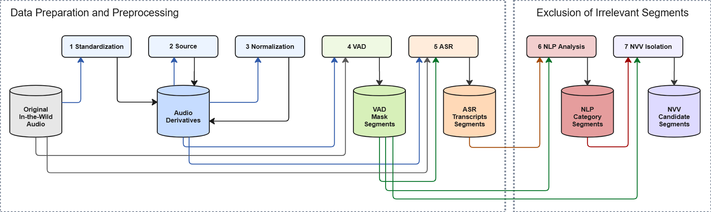

# A Data-Driven Audio Processing Pipeline for Isolating Human Non-Verbal Vocalizations from In-the-Wild Recordings
## Master's Thesis in Media Informatics, University of Applied Sciences Düsseldorf (HSD)

This repository contains the **NVV Isolation Pipeline**, developed as part of a **Master’s Thesis** at HSD. It isolates human non-verbal vocalization (NVV) candidate segments from **unlabeled in-the-wild audio recordings** without relying on predefined NVV categories or NVV-specific supervised training. It produces **precisely timestamped NVV candidate segments** and **intermediate artifacts** for reproducible inspection, evaluation, and large-scale dataset construction.

## Project Context
This work contributes to the project  
**[Understanding Nonverbal Vocalizations: A Computational Ethology Approach (VOCAL)](https://www.nwo.nl/en/projects/vic221052)** (Universiteit van Amsterdam).  

Within this context, the pipeline supports **data-driven, bottom-up research on human non-verbal vocalizations** (e.g., laughter, sighs, breathing, coughing, etc.) for emotion-related research, enabling the construction of large-scale datasets from naturalistic audio data.


# NVV Isolation Pipeline
The NVV Isolation Pipeline is a **data-driven, multi-stage audio processing pipeline** for isolating non-verbal vocalizations from in-the-wild audio.
## Key Features
- **Exclusion-Based NVV Isolation**: NVV candidates are derived as residual segments after excluding lexical speech and non-vocal regions, therefore not relying on predefined categories.

- **Artifact-Based Design**: Intermediate outputs such as audio derivatives, VAD masks, ASR transcripts, NLP segments, and NVV candidates are preserved for inspection and reproducibility.

- **Configurable Multi-Stage Pipeline**: Audio derivatives, VAD masks, and ASR inputs can be systematically combined and evaluated.

- **In-the-Wild Audio Support**: The pipeline is designed for heterogeneous naturalistic recordings, including audio derived from YouTube videos.

## Related Pipelines
The NVV Isolation Pipeline is conceptually inspired by the Emilia-Pipe ([He et al., 2025](https://arxiv.org/abs/2501.15907), [He et al., 2024](https://arxiv.org/abs/2407.05361)), the NonVerbalSpeech-38K Pipeline ([Ye et al., 2025](https://doi.org/10.48550/arXiv.2508.05385)), and AVC-FillerNet ([Zhu et al., 2022 ](https://arxiv.org/abs/2203.15135)) but redesigned for **unlabeled, data-driven, exclusion-based NVV isolation** and examines a preview-sample of the VOCAL dataset (Militaru, E., Huber, F., Sauter, D., in preparation).

## Processing Steps



The pipeline consists of seven processing steps:

- **Standardization** – peak normalization and format alignment for source separation  
- **Source Separation** – decomposition into vocals and background (UVR-MDX)  
- **Normalization** – RMS-based normalization for analysis (mono, 24 kHz)  
- **VAD** – high-recall segmentation using hybrid Silero + energy refinement  
- **ASR** – verbatim, time-aligned transcription (supporting NVV-sensitive analysis)  
- **NLP Analysis** – lexical classification into speech vs. non-lexical categories  
- **NVV Isolation** – exclusion-based extraction of NVV candidate segments

The pipeline produces **time-aligned NVV candidate segments with precise timestamps**, along with intermediate artifacts for analysis and reproducibility.

See the [Detailed Pipeline Specification](#detailed-pipeline-specification) for a full description of inputs, outputs, and parameters.


### Export

| Step | Function |  Notes |
|------|-----------|-------|
| **Exports** | Export of Audacity compatible label-files | Can be used to subtitle Youtube-Videos or inspect results |


### Potential Extensions

- Improve recall through further VAD and source separation experiments.
- Explore additional preprocessing for heterogeneous in-the-wild recordings.
- Investigate optional onset refinement for NVV boundary improvement.

## Environment and Installation
The pipeline is executed in a dedicated Python environment (Conda recommended), defined via an `environment.yml` file to ensure reproducibility across systems.

### Setup
```bash
conda env create -f environment.yml
conda activate nvv_isolation_pipeline
```
To export the current environment:
```bash
conda env export > environment.yml
```
### Core Dependencies
The implementation relies on the following key libraries:

- PyTorch / torchaudio – model execution (GPU/CPU)
- ONNX Runtime (onnxruntime-gpu) – source separation (UVR-MDX)
- transformers (Hugging Face) – ASR model loading (CrisperWhisper)
- spaCy + wordfreq – linguistic analysis
- librosa / soundfile – audio processing
- Silero-VAD – voice activity detection

### Model Integration
The pipeline combines locally stored models and automatically downloaded models:

#### Local Models (included in repository)
The Source Separation model `models/UVR-MDX-NET-Inst_3.onnx` is used in Step 2 (ONNX inference).  
No additional setup required. 
Default: CPU usage.  
If GPU is available and should be used, check ONNX providers:
  ```bash
  python -c "import torch, onnxruntime as ort; print(torch.cuda.is_available(), ort.get_available_providers())"
  ```
If `torch.cuda.is_available()`is `True` but `CUDAExecutionProvider` is missing, fix with:
```bash
pip uninstall -y onnxruntime
pip install --upgrade --force-reinstall --no-cache-dir onnxruntime-gpu==1.18.1
```


#### Hugging Face Models (automatic download)
The Automatic Speech Recognition (ASR) model `nyrahealth/CrisperWhisper`, loaded via `transformers.from_pretrained(...)` is used in Step 5.  
The Setup requires internet connection and Hugging Face access on first run. (The model is cached locally after the first download.):
```bash
huggingface-cli login
```

#### spaCy Model (automatic download)
The NLP step uses a configurable spaCy model (default: `en_core_web_lg`). If the model is not installed, it is automatically downloaded at runtime. Optional manual installation:
```bash
python -m spacy download en_core_web_lg
```

#### External Dependencies
FFmpeg may be required for some audio backends (e.g., via `librosa`) and should be available on the system (not only in the environment)

#### Current environment

- Conda environment: **`nvv_isolation_pipeline`**
- Python 3.10  
- GPU-accelerated (CUDA 12.8, depending on system)
- Tested on RTX 4090 (remote)

## Running the Pipeline

### Full run (All Steps)
Run the complete pipeline for all batches defined in the YAML config:
```bash
# from project root
python run_pipeline.py --config ./config/config.yaml
```

### Stepwise execution (run single steps)
You can run each step individually via its CLI entry point.

```bash
# Step 1 – Standardization
python -m pipeline.step_1_standardize --input ./data/raw/test_audio --workspace ./data/processed/test_audio --device auto --force 
# Step 2 – Source Separation (UVR)
python -m pipeline.step_2_separate --workspace ./data/processed/test_audio --model ./models/UVR-MDX-NET-Inst_3.onnx --device auto --force
# Step 3 – Normalization
python -m pipeline.step_3_normalize --workspace ./data/processed/test_audio --device auto --force
# Step 4 – VAD (Hybrid Silero + Energy)
python -m pipeline.step_4_vad --workspace ./data/processed/test_audio --audio-derivatives original,vocals_norm,background_norm --device auto --force
# Step 5 – ASR (CrisperWhisper)
python -m pipeline.step_5_asr --workspace ./data/processed/test_audio --utils_path ./utils/crisperwhisper_utils.py --vad_masks no vocals_norm --asr_audios_in vocals_norm background_norm --device auto --force
# Step 6 NLP (spaCy)
python -m pipeline.step_6_nlp --workspace ./data/processed/test_audio --spacy-model en_core_web_lg --auto-download --force
# Step 7 NVV Candidates
python -m pipeline.step_7_nvv --workspace ./data/processed/test_audio --exclude_categories word --min_duration 0.2 --max_duration 2.0 --vad_masks_in no vocals_norm --asr_audios_in vocals_norm background_norm --vad_gate_padding 0.0 --force
```

### Exports
Exports are intentionally decoupled from the pipeline steps. They can be executed independently on an existing workspace.
```bash
# Export everything (labels + clips) for one workspace
python run_exports.py --workspace ./data/processed/test_audio
```
#### Export only labels 
```bash
# Default: all (VAD+ASR+NVV if no subtype flags are set)
python run_exports.py --workspace ./data/processed/test_audio --labels

# Export only a specific label type:
python run_exports.py --workspace ./data/processed/test_audio --labels --vad
python run_exports.py --workspace ./data/processed/test_audio --labels --asr
python run_exports.py --workspace ./data/processed/test_audio --labels --nvv
```
#### Export only clips
```bash
# NVV clips
python run_exports.py --workspace ./data/processed/test_audio --clips --clip-mode nvv

# word clips (from NLP chunks)
python run_exports.py --workspace ./data/processed/test_audio --clips --clip-mode words

# Optional clip sub-directory (workspace mode):
python run_exports.py --workspace ./data/processed/test_audio --clips --clip-mode nvv --sub-dir exploration

# Filter exports by tokens (repeatable)
python run_exports.py --workspace ./data/processed/test_audio --labels --nvv --vad-mask no --asr-audio-in vocals_norm
```
#### Export via config
```bash
# Run exports for all batches via config (optional)
python run_exports.py --config ./config/config.yaml

# Custom subfolder for config-mode clip exports
python run_exports.py --config ./config/config.yaml --subfolder subfolder_name
```

### Notes & Best Practices
- Processing unit = audio_id folder. Each `per_audio/<audio_id>/` is an independent unit and can be resumed safely. 
- Single Source of Truth = artifacts on disk. Steps iterate over existing files; metadata is written for traceability but not used as the primary driver.
- `--force` overwrites outputs. Use it when you intentionally want to recompute a step or re-export artifacts. 
- VAD runs Silero (16 kHz) + energy-based refinement for robust NVV recall.  
- All intermediate outputs are saved in `per_audio/audios/`, `per_audio/annotations/`, and `per_audio/labels/`, `global/clips` and `global/evaluation` for full reproducibility.  
- ASR supports flexible audio/VAD-mask combinations 
- Absolute paths are stored in `per_audio/<audio_id>/<audio_id>_metadata.json` for reproducible export and batch linking.

## Detailed Pipeline Specification
Each step is independent and resume-safe (`<audio_id>_metadata.json` tracks progress and artifacts per audio_id).  
All steps are file-driven and artifact-based. No hidden state is used.

| Step | Function | Input | Output | baseline-params | Notes |
|------|----------|-------|--------|----------------|-------|
| **1. Standardize** | Peak-normalize input audio for source separation (44.1 kHz stereo PCM16) | `<Input-Folder>`:<br> Raw Input Audio  |  `<workspace>/per_audio/<audio_id>/audios/`: <br>Standardized audio `<audio_id>_std.wav` | `SEPARATION_SAMPLING_RATE = 44100 Hz`<br>`Peak normalization` | Ensures UVR-compatible input (stereo, 44.1 kHz, peak-normalized). No content modification beyond amplitude scaling. |
| **2. Separate (UVR-MDX-Net Inst 3)** | Split into vocals and background stems | `<workspace>/per_audio/<audio_id>/audios/`: <br>Standardized Audio <br> `*_std.wav` | `<workspace>/per_audio/<audio_id>/audios/`: <br> Separated Audios <br> `*_vocals.wav`<br>`*_background.wav` | `Model = UVR-MDX-NET-Inst_3.onnx`<br>`CUDA auto-detection` | ConvTDFNet ONNX model. Deterministic separation into two stems. No speaker separation. |
| **3. Normalize** | RMS-normalize separated tracks for analysis (24 kHz mono) | `<workspace>/per_audio/<audio_id>/audios/`: <br> Separated Audios <br>`*std_vocals.wav`<br>`*std_background.wav` |  `<workspace>/per_audio/<audio_id>/audios/`: <br> Normalized separated audios<br>`*_vocals_norm.wav`<br>`*_background_norm.wav` | `ANALYSIS_SAMPLING_RATE = 24000 Hz`<br>`TARGET_DBFS = -20 dBFS ± 3 dB` | Converts to mono 24 kHz for VAD + ASR stability. RMS normalization only (no compression, no limiting). |
| **4. VAD (Hybrid Silero + Energy)** | Detect speech-like regions with high recall |  `<workspace>/per_audio/audio/`: <br>Any analysis audio derivative (`*_norm.wav`, `*_std.wav`, or original`) | `<workspace>/per_audio/<audio_id>/annotations/vad/`: <br> VAD mask <br> `<audio_id>_<source>_vad.json` | `VAD_THRESHOLD = 0.3`<br>`VAD_MIN_SPEECH_MS = 75`<br>`VAD_MIN_SILENCE_MS = 75`<br>`VAD_PAD_MS = 50`<br>`VAD_SMOOTHING_WINDOW = 400`<br>`VAD_ENERGY_REL_THRESHOLD = 0.4`<br>`VAD_EXPAND_PRE = 0.01`<br>`VAD_EXPAND_POST = 0.01`<br>`VAD_EXPAND_STEP = 0.01` | Hybrid Silero-VAD (16 kHz) + energy-based boundary refinement. Designed for high recall. No speaker diarization. |
| **5. ASR (CrisperWhisper + DTW Patch)** | Word-level transcription with robust timestamps | `<workspace>/per_audio/<audio_id>/audios/`:<br>Any analysis audio derivative as Audio-Input, combined with <br> `<workspace>/per_audio/<audio_id>/annotations/vad/` Any VAD mask for Audio-Input. <br> Or: Original audio without VAD mask | `<workspace>/per_audio/<audio_id>/annotations/asr/`:<br>ASR segments<br>`<audio_id>_<vad_mask>_vad_<audio_derivative>_asr.json` | `Model = CrisperWhisper`<br>`return_timestamps = "word"`<br>`DTW alignment enabled`<br>`median_filter_width (HF default)`<br>`pause_split_threshold = 0.12 s` | Word-level timestamps computed via DTW-based alignment (CrisperWhisper). Minimal post-processing: repair of some `None` end timestamps and overlap clamping. No aggressive timestamp interpolation. |
| **6. NLP Speechmask (Lexical Filter)** | Lexical classification of ASR chunks | `<workspace>/per_audio/<audio_id>/annotations/asr/`: ASR segments<br>`*_asr.json` | `<workspace>/per_audio/<audio_id>/annotations/nlp/`: NLP category segments (Speechmask) and log-file<br>`<stem>_nlp.json`<br>`<stem>_nlp_log.json` | `spaCy model = en_core_web_sm`<br>`exclude_categories default = ["word"]` | Classifies each ASR chunk into `word / filler / non_word / oov / unknown`. Does not modify timestamps. Broken JSON → raise. Valid empty → preserved. |
| **7. NVV Candidate Extraction (Strict Gate)** | Derive NVV candidates from NLP (optionally VAD-gated) | `<workspace>/per_audio/<audio_id>/annotations/nlp/`: NLP category segments (Speechmask)`*_nlp.json` combined with <br> `<workspace>/per_audio/<audio_id>/annotations/vad/` VAD mask `*_vad.json`  | `<workspace>/per_audio/<audio_id>/annotations/nvv/`: <br>NVV Candidate Segments<br>`<stem>_nvv.json` | `exclude_categories = ["word"]`<br>`STEP7_MIN_NVV_LENGTH_S`<br>`STEP7_MAX_NVV_LENGTH_S`<br>`STEP7_VAD_GATE_PADDING`<br>`STEP7_DEDUP_OVERLAP_RATIO`<br>`STEP7_DEDUP_TIME_TOL_S` | Deterministic extraction. Drops chunks with invalid timestamps (`None`). Optional strict VAD gate + VAD-gap detection. Duration filtering and deduplication applied. |

## Configuration
The configuration of the workspace is defined in `<your_config>.yml`
Raw data is (per default) expected to be organized as a folder in the `data/raw/`.
The default configuration (customization possible, but not recommended) is organized as follows:
```
project_root/
│
├── config/
│   └── <your_config>.yml
├── data/
│   ├── processed/
│   │   └── <workspace.datasets.output_rel>/                
│   └── raw/
│       └── <workspace.datasets.input_rel>/   
│            └── <audio_id>.wav   # original audio
.
.
.
```

**Workspace folder (pipeline-output):**
```
<workspace.datasets.output_rel>/
├── global/
│   ├── clips/ 
│   └── evaluation/ 
│       └── /<evaluation-mode>
└── per_audio/
    └── <audio-id>/
        ├── <audio-id>_metadata.json
        ├── audios/
        │   └── <audio-id>_<audio_derivative>.wav # [std, std_vocals, std_background, std_vocals_norm, std_background_norm]
        ├── evaluation/
        │   └── /<evaluation-mode>
        ├── annotations/
        │   ├── vad/
        │   │   └── <audio-id>_<vad_audio_in>_vad.json
        │   ├── nlp/
        │   │   ├── <audio-id>_<vad_mask>_vad_<asr_audio_in>_asr_nlp.json
        │   │   └── <audio-id>_<vad_mask>_vad_<asr_audio_in>l_asr_nlp.log
        │   ├── nvv/
        │   │   └── <audio-id>_<vad_mask>_vad_<asr_audio_in>_asr_nlp_nvv.json 
        │   └── asr/
        │       └── <audio-id>_<vad_mask>_vad_<asr_audio_in>_asr.json
        └── labels/
            ├── vad/
            │   └── <audio-id>_<vad_audio_in>_vad.txt
            ├── nvv/
            │   └── <vad_mask>_vad_<asr_audio_in>_asr_nlp_nvv.txt        
            └── asr/
                └── <vad_mask>_vad_<asr_audio_in>_asr.txt
```

## Running Evaluation
### Preprocessing Ground Truth Annotations (VOCAL specific)

Before running evaluation, ground-truth annotations can be prepared via a dedicated preprocessing runner to assure required structure for evaluation.
The required columns of a Ground Truth (GT) file and description of preprocessing only meets VOCAL GT structure and needs customized mapping for other datasets to the VOCAL project file structure.
Expected xls-header: 
```bash
id_column: str = "video_id",              # audio_id
ann_id_column: str = "ann_id",            # id of nvv-event annotation
start_column: str = "start_s",            # timestamp in seconds
end_column: str = "end_s",                # timestamp in seconds
label_column: str = "vocalization_type",  # free label,
```

```bash
# run ground truth preprocessing from config
python run_preprocessing.py --config ./config/config.yaml
```

```bash
# copying VOCAL dataset before pipeline
python run_preprocessing.py --config ./config/config.yaml --copy-vocals
```

### Generate Evaluation Metrics
```bash
# run evaluation from config
python run_evaluation.py --config ./config/config.yaml
```

## Running Experiments
Find more details on Parameter-Screening and evaluation of many pipeline-runs in the [Experiment-Description](/experiments.md)
```bash
# run experiment from separate experiment-config
python run_experiments.py --config ./config/config.yaml --experiment ./experiments/my_experiment.yaml 
```


## Evaluation & Research Findings
A quantitative evaluation examines the capability of the NVV Isolation Pipeline to isolate non-verbal vocalizations from in-the-wild audio recordings. The evaluation was conducted on [NonVerbalSpeech-38K](https://huggingface.co/datasets/nonverbalspeech/nonverbalspeech38k) (EN subset) and a restricted-access VOCAL preview sample.

- **Results**: The pipeline achieves **moderate recall (~0.23–0.27)** across evaluation datasets, while correctly isolated events show **consistently high temporal alignment**, indicating precise boundary localization.

- **Configuration Sensitivity**: Performance depends strongly on configuration choices. **VAD** emerges as a central bottleneck. Combining configurations improves results, indicating complementary NVV candidates across audio derivatives. **Verbatim, time-aligned ASR** supports preserving and localizing non-lexical vocalizations.

- **Method Insight**: No single audio derivative consistently outperforms others; NVV candidates are not confined to a single audio derivative, which motivates the use of multiple audio derivatives within the pipeline.

- **Coverage**: Some NVV types are more reliably isolated than others, but no consistent pattern can be established due to annotation constraints.


**Maintainer:** *Mareike Focken — Master Thesis 2026*  
**Environment:** `environment.yml`  
**GPU:** NVIDIA GeForce RTX 4090 (HSD remote, CUDA 12.8)
